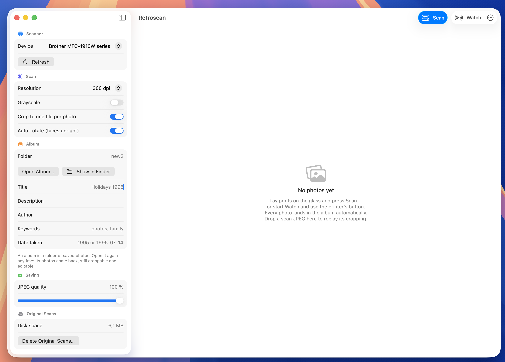

# 📸 retroscan

I had boxes of family photo prints to digitize and no patience for feeding
them to a scanner one print at a time. retroscan is what came out of it.

A macOS CLI **and app** (Swift, zero dependencies, zero drivers) that scans
from a networked Brother printer, cuts every print out of the page, puts
faces upright and embeds the metadata: lay six prints on the glass, press
the printer's own Scan button, get six tagged JPEGs in the album folder.
Then do it again with the next six.

Tested with a Brother MFC-1910W. Works with any Brother device exposing the
`_scanner._tcp` Bonjour service (port 54921, the protocol behind the SANE
`brscan` backends) — **no Brother driver needed**, even on macOS versions
where none exists anymore.

## ✨ What it does

- 🖨️ **Driverless scanning** — speaks the Brother network scan protocol directly
- ✂️ **Multi-photo cropping** — lay several prints on the glass, get one tight
  file per photo (paper borders shaved off)
- 🔄 **Auto-rotation** — face detection puts people the right way up
- 🏷️ **Metadata** — original shooting date, title, keywords, author, scanner
  model, DPI, all embedded in EXIF/IPTC/TIFF
- 🔘 **Watch mode** — press the printer's Scan button, the Mac does the rest

## 🚀 Install

```sh
make build       # CLI: swift build -c release + sudo cp to /usr/local/bin
make app         # app: assembles and installs /Applications/Retroscan.app
make check       # self-check the crop pipeline on synthetic pages (no scanner)
```

## 🖥️ The app



`make app` installs **Retroscan.app**, a SwiftUI front-end to the same
engine (both are thin layers over the `RetroscanKit` library target):

- pick the scanner, resolution, crop/rotate toggles and album metadata in a
  sidebar
- every scan is **saved to the album immediately**, numbered like the CLI
  does — the grid shows the album, nothing is ever lost with the app closed
- and **every photo stays editable**: adjust the crop by hand (the crop
  button opens the scanned page with draggable corner handles, Apply
  re-crops from the full-resolution source — growable beyond the detected
  frame), rotate, or change the per-photo date/description (the ⓘ button);
  the JPEG is rewritten in place. The trash button moves a reject to the
  macOS Trash
- **Re-process** re-runs the last scan through the pipeline with the current
  settings (change the crop or grayscale toggle without rescanning) — the
  batch's files are replaced, the old ones go to the Trash
- **Watch** registers on the printer's *Scan to PC* menu, like `retroscan
  watch` — a whole album digitizes without touching the Mac
- every output folder is a **reopenable project**: a hidden `.retroscan.json`
  records the album metadata plus, per saved file, the overrides and a
  pointer to its original scan — pick the folder again later and the saved
  photos come back in the grid, crops still adjustable; app-level settings
  (scanner, resolution, author…) persist across launches
- the **original scanned pages are kept** in an app-managed cache so crops
  stay editable forever; the sidebar shows the disk space and *Delete
  Original Scans* reclaims it when an album is truly done (*Clear Grid*
  never touches it)

## 🎯 Usage

```sh
retroscan                          # 300 dpi color, one file per print, current dir
retroscan --list                   # list scanners on the network
retroscan -r 600 -m gray -o ~/Documents/Scans
retroscan -t "Holidays 1995" -D 1995 -k photos,family -a "Mathieu"
retroscan --no-crop                # keep the scanned page whole
retroscan -R none                  # disable auto-rotation
retroscan --input page.jpg         # re-run crop/rotate/metadata on an existing scan
```

`retroscan --help` shows every option.

With `--title` (or `--name`), files come out as `Holidays 1995-1.jpg`,
`-2.jpg`, … and **numbering continues from one run to the next** in the same
folder: perfect for digitizing an album a few prints at a time. Without a
title, each run gets a timestamped `scan-<timestamp>` base.

## 🔘 Watch mode: scan from the printer's button

```sh
retroscan watch -t "1995" -D 1995 -o ~/Documents/Scans/1995
```

The Mac registers itself on the device's **Scan to PC** menu (the
`brscan-skey` protocol: an SNMP registration plus a UDP callback). Then:
lay photos on the glass → press the printer's **Scan** button → pick
*retroscan* on its LCD → files appear on the Mac, numbered in sequence.
You never touch the computer during a scanning session.

⚠️ If Brother's driver package is installed, its `NETserver` daemon squats
UDP port 54925 — where the device actually sends its button notifications,
whatever port you advertise. retroscan will tell you; free the port with
`pkill -x NETserver` (it comes back at next login via the
`com.brother.LOGINserver` launch agent — remove that from
`/Library/LaunchAgents/` for a permanent fix).

## ✂️ How cropping works

There is one crop mode, and it is the one this tool exists for: every print
found on the glass becomes its own tight file.

1. The page is reduced to a content mask — luminance **and** local gradient,
   because a washed-out sky can scan brighter than the bed while its paper
   edge is always a step. The background level is measured from the page
   frame, so a dark backing sheet works as well as the bare white bed.
2. Connected components become candidate regions, and any region crossed by
   a narrow all-background seam is split again: prints laid almost touching
   still come out separate.
3. Each region is snapped to the print's true rectangle (Vision edge
   detection, perspective-corrected) or, failing that, tightened until no
   white paper border is left — losing a sliver of photo beats keeping a
   white margin.

Nothing print-shaped on the page? The scan is saved whole. `--no-crop` (in
the app: the *Crop to one file per photo* toggle) skips detection entirely.

## 🔄 Auto-rotation

`--rotate auto` (default): Vision face detection in all four orientations,
weighted by face roll angle — photos of people come out upright. Photos with
no detectable face are left as scanned. `--rotate 90|180|270` forces a
clockwise rotation, `none` disables.

## 🏷️ Embedded metadata

Always: scan date (EXIF DateTimeDigitized), scanner make/model and software
(TIFF), DPI. Optional: `--title` (IPTC ObjectName), `--keywords` (IPTC),
`--author` (TIFF Artist + IPTC Byline), `--description` (EXIF UserComment +
TIFF ImageDescription + IPTC Caption), and `--date` — when the photo was
**taken** (`1995`, `1995-07` or `1995-07-14`), written to EXIF
DateTimeOriginal + IPTC DateCreated: the field Apple Photos, Google Photos
and Lightroom sort by.

## 🖤 Tip: photos with near-white edges

A print whose edge is itself nearly white (washed-out sky, white
tablecloth…) can be indistinguishable from the scanner bed. The bulletproof
fix costs nothing: lay a **dark sheet of paper** over the photos before
closing the lid, covering the whole glass. retroscan detects the background
level automatically and the crop becomes trivial, white edges included.

`RETROSCAN_DEBUG=1 retroscan …` prints the detected background level and
regions — handy with `--input file.jpg` to replay a surprising crop without
touching the scanner.

## 🔌 Protocol notes (MFC-1910W)

- Banner `+OK 200` on connecting to TCP 54921.
- Query: `ESC I \n R=x,y \n M=mode \n 0x80` → `0x00 <len:2 LE> <csv> 0x00`
  (resolution, width mm/px, height mm/px).
- Scan: `ESC X` with `M=CGRAY` (= **24-bit color** JPEG, counter-intuitively),
  `C=JPEG`, `A=0,0,w,h`, `D=SIN`. The hardware gray mode (`GRAY64`) uses an
  RLE encoding — gray output is produced locally instead.
- Stream: `0x64` blocks (12-byte header, length at bytes 10-11 LE, JPEG
  payload), `0x82` end of page, `0x80` end of session, `0xc2` feeder empty,
  `0xc3` paper jam, `0xc4` cover open.
- Scan button: SNMPv1 SET (community `internal`, OID
  `1.3.6.1.4.1.2435.2.3.9.2.11.1.1.0`) registers the host; the device then
  sends a UDP datagram to the advertised port on each button press.
- ⚠️ An invalid scan command (e.g. `M=C24BIT`, a family-5 mode) wedges the
  printer's scan service for about a minute.

## 🙏 Credits

- Protocol details cross-checked against the in-progress
  [`brother_mfp` SANE backend](https://gitlab.com/sane-project/backends/-/merge_requests/751).
